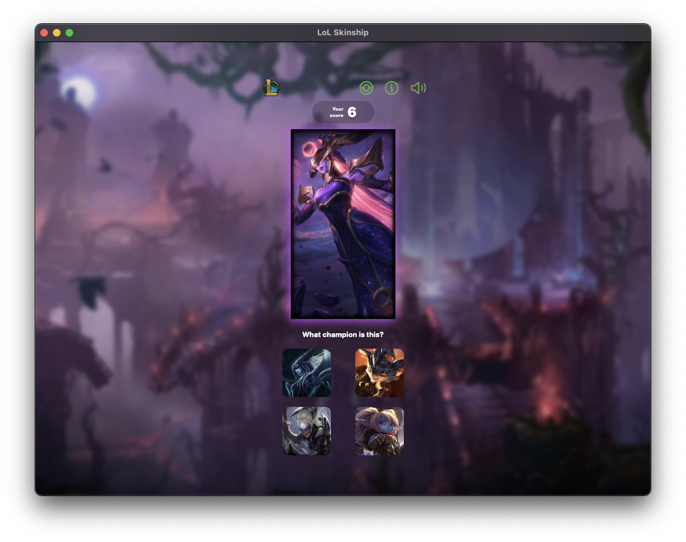

# League of Legends: Skinship (iOS)

// TODO: README will be updated when I have more time. Doc is available [here](https://github.com/hoangdesu/LeagueOfLegends-Skinship-iOS/blob/main/document.pdf). Here is some screenshots for the app:

|    |    |  
| ---- | ---- | 
|    |    |  
|    |    |  
|    |    |  
|    |    |
|    |    |

## Table of Contents

- [About](#about)
- [Requirements](#requirements)
- [Features](#features)
- [Demo video](#demo)
- [Acknowledgement](#acknowledgement)
- [Connections](#connections)

# About

# Requirements
- Deployment target: iOS 15.5
- XCode 13.4.1
- Swift 5.5.2
- SwiftUI 3

# Features

# Demo video

Full demo video on the iPhone 12: https://www.youtube.com/watch?v=8ojc1XNDAZI

# Acknowledgement

# Connections

* <a href="https://hoangdesu.com/" target="_blank">Website</a>
* <a href="https://www.linkedin.com/in/hoangdesu/" target="_blank">LinkedIn</a>
* <a href="https://www.facebook.com/Hoangdayo/" target="_blank">Facebook</a>
* <a href="https://www.instagram.com/hoang.desu/" target="_blank">Instagram</a>
* <a href="mailto:hoangdesu@gmail.com" target="_blank">Email</a>

---
If you find this project useful, drop me a star ⭐️. I would love to hear about it!
